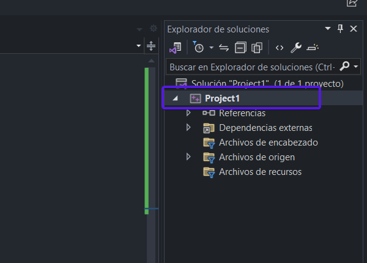
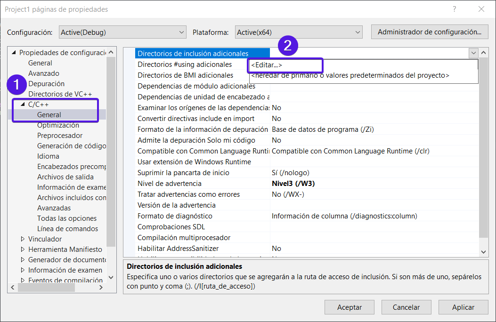
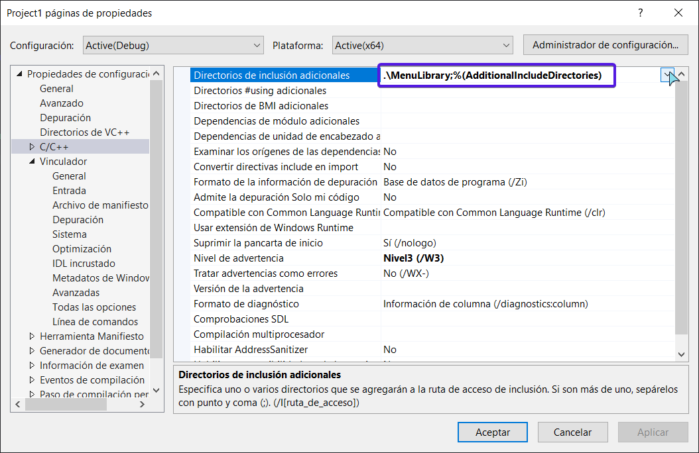
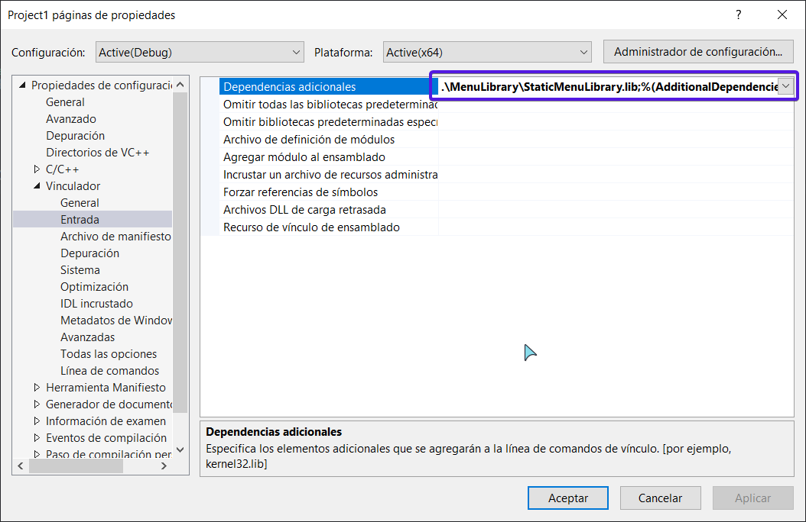

# Menú para la consola en C++ 🖥

## ℹ Instalación y Uso 
 1. Descarga la carpeta `FileLibrary`
 2. Inclúyalo en su carpeta de trabajo
 3. Dirigite al **Explorador de soluciones** y en el proyecto da click derecho y dirigete a donde dice **propiedades** o presiona `alt+enter`
  
  
  - Ahora debes dirigirte a `propiedades > C/C++ > Directorio de inclusion adicionales` 
  
  ahí debes colocar la ruta de la carpeta FileLibrary que debe estar dentro de la carpeta del proyecto. Ejemplo de la ruta `./FileLibrary`
  
  - Luego, debes dirigirte a `Vinculador > Entrada > Dependencia Adicionales` y colocar la ruta en donde se encuentra el archivo `.lib`. Ejemplo: `\FileLibrary\FileLibrary.lib`
   

 4. Finalmente solo debes incluir el archivo de encabezado `FileLibrary.h`
  ~~~C++
  // archivo .cpp u otro .h 

    #include "FileLibrary.h" 
  ~~~

## 📎 Descripción del programa

 El programa permite trabajar con archivos `.dat`, `.txt`, entre otros de manera facil y sencilla.Además, se crearan carpetas y subcarpetas con una sintaxis simple y legible 
 Con esta librería podrás gestionar todos tus archivos.

### Inicialización Dinámica
~~~C++
    // se incluye la libreria 
    #include "FileLibrary.h" 

   /* crea un objeto de tipo "archivo" en una carpeta raiz llamada "Users"
    - Los parametros del constructor son: (Carpeta raíz, tipo de archivo) */
	  FileLibrary* archivo = new FileLibrary("Users");

    // dentro de la carpeta raiz creo un subfolder con el nombre del id de mario
	  archivo->createSubfolder(mario3.getID());
	
    // accedo al archivo dentro de la subcarpeta anterior y creo un archivo .dat 
    // El uso del operador [] sirve para trabar dentro de subdirectorios
    (*archivo)[mario3.getID()].log(mario3.getName(), 3, data1);
  

~~~
>Nota: Por defecto el tipo de archivo esta en .dat

### Inicialización Estatica
~~~C++
    // se incluye la libreria 
    #include "FileLibrary.h" 

    // crea un objeto de tipo "archivo" en una carpeta raiz llamada "Users"
    Files archivo ("Users");	

    // dentro de la carpeta raiz creo un subfolder con el nombre del id de mario
    archivo.createSubfolder(mario.getID());
	 
   // accedo al archivo dentro de la subcarpeta anterior y creo un archivo .dat 
   // El uso del operador [] sirve para trabar dentro de subdirectorios
    archivo[mario.getID()].log("name", 3, data1); 

~~~